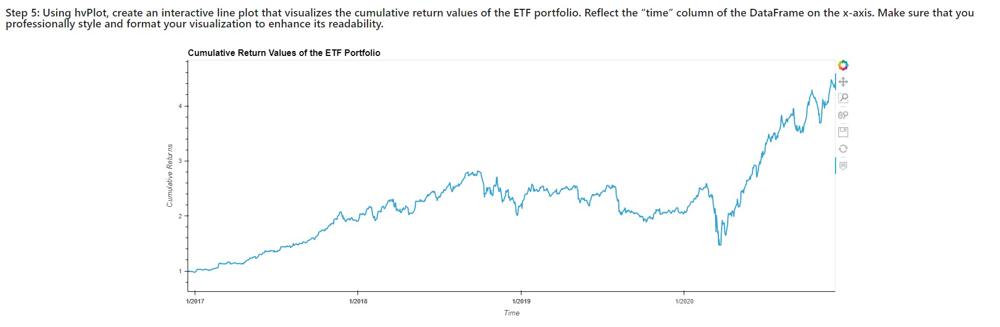

# Passive Investing
*PASSIVE INVESTING* is financial application that uses SQL, Python, and the Voilà library to analyze and visualize the performance of fintech ETF.


## Requirements

This application was writen in Jupyter Lab 3.3.2 using Python 3.9.7

**Operating System:**

-   Window 10 (or higher) using Gitbash.
-   MacOS 10.14 (or higher) using a terminal.
-   Linux Ubuntu 22.04 (or higher) using a terminal.

**Will need to be installed:**

_jupyter lab_  3.3.2

```
$ pip install jupyterlab
```

_pandas_  1.4.2
```
$ pip install pandas
```

_numpy_  1.22.3

```
$ pip install numpy
```

hvPlot 0.8.0

```
$ pip install hvplot

```

sqlalchemy  1.4.36
```
pip install SQLAlchemy

```
----------

## Installation

To install the application you will need to clone the GitHub repository.

```
$ git clone https://github.com/yanickw/passive_investing

```

----------

## Get Started

Using the  Passive Investing Notebook:

Open a gitbash, navigate to your github cloned repositery. Start  _Jupyter Lab_

```
$ jupyter lab
```

### 1. Analyze a Single Asset in the ETF.

Use SQL queries with Python, Pandas, and hvPlot to analyze the performance of a single asset from the ETF.


### 2. Optimize Data Access with Advanced SQL Queries.

Analyze a single asset from the ETF. You’ll use advanced SQL queries to optimize the efficiency of accessing data from the database.

### 3. Analyze the ETF Portfolio.

Build an entire ETF portfolio and then evaluate its performance. To do so, you have to build the ETF portfolio by using SQL joins to combine all the data for each asset.

### 4. Deploy the Notebook as a Web Application

Using the Voilà library to deploy your notebook as a web application.



----------

## Contributors

This application originated from a Berkeley Bootcamp.

For any inquieries, feedbacks or comments about this project please email me at  [yanickw@gmail.com](mailto:yanickw@gmail.com)

I can also be reached on  [LinkedIn](https://www.linkedin.com/in/yanickwilisky/)  or  [Twitter](https://twitter.com/yanickwilisky).

----------

## License

MIT License

Copyright (c) 2022 Yanick Wilisky

Permission is hereby granted, free of charge, to any person obtaining a copy of this software and associated documentation files (the "Software"), to deal in the Software without restriction, including without limitation the rights to use, copy, modify, merge, publish, distribute, sublicense, and/or sell copies of the Software, and to permit persons to whom the Software is furnished to do so, subject to the following conditions:

The above copyright notice and this permission notice shall be included in all copies or substantial portions of the Software.

THE SOFTWARE IS PROVIDED "AS IS", WITHOUT WARRANTY OF ANY KIND, EXPRESS OR IMPLIED, INCLUDING BUT NOT LIMITED TO THE WARRANTIES OF MERCHANTABILITY, FITNESS FOR A PARTICULAR PURPOSE AND NONINFRINGEMENT. IN NO EVENT SHALL THE AUTHORS OR COPYRIGHT HOLDERS BE LIABLE FOR ANY CLAIM, DAMAGES OR OTHER LIABILITY, WHETHER IN AN ACTION OF CONTRACT, TORT OR OTHERWISE, ARISING FROM, OUT OF OR IN CONNECTION WITH THE SOFTWARE OR THE USE OR OTHER DEALINGS IN THE SOFTWARE.